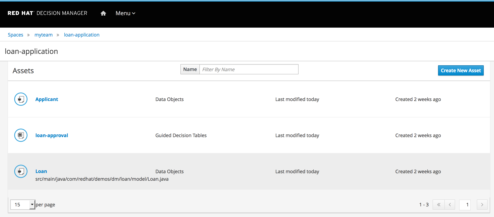
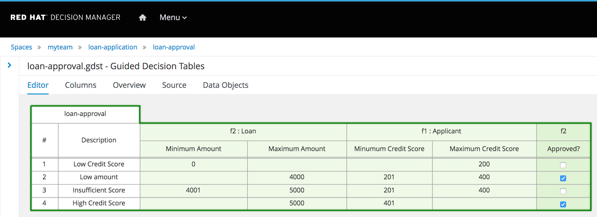

# WORKSHOP RHDM7
Workshop sobre o Red Hat Decision Manager 7 (ex-BRMS)

## Laboratório 03 - Autoria de Regras
Este laboratório explorará a criação e autoria das regras. Serão criadas regras para o um projeto fictício de empréstimo (loan). O detalhamento é feito através [deste vídeo](https://drive.google.com/file/d/1tZNw9oXXMAFJ1dOyCSoUq0Z-gTjz4lpI/view).

[Este projeto](https://github.com/jbossdemocentral/rhdm7-loan-demo) no Github descreve o processo para a criação das regras.

Enquanto [este projeto](https://github.com/jbossdemocentral/rhdm7-loan-demo-repo) possui os fontes para importação dentro do Red Hat Decision Manager 7.

