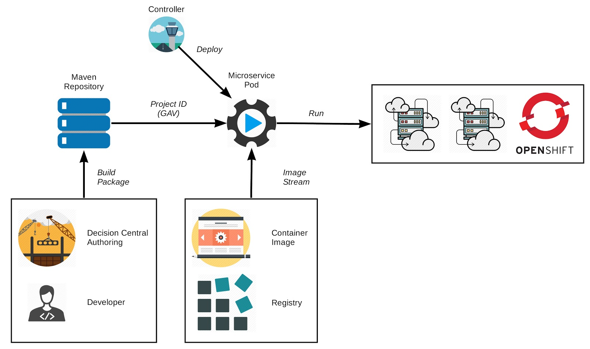

# WORKSHOP RHDM7
Workshop sobre o Red Hat Decision Manager 7 (ex-BRMS)

## Laboratório 04 - Deployment de Regras
Este laboratório explorará o deployment das regras. Existem algumas opções para isso. Trabalharemos com dois formatos:

1. Decision Deployment Unit (KJar) no Decision Central
2. Source to Image (S2I) no Openshift

## Decision Deployment Unit (KJar) no Decision Central

Esta opção cria um Decision Deployment Unit (KJar) via Decision Central (ou como um pipeline no Openshift) e faz o push do Decision Central para o KIE-Controller do Decision Server. O Decision Server faz o pull do deployment unit (KJar) do repositório Maven.

Esta opção é utilizada quando o usuário quer controlar o deployment das regras da interface visual do Decision Central ou KIE-Controller. Pode ser feito o deploy de novas regras em runtime sem a necessidade de um build de uma imagem de container do Decision Server.

Este processo é semelhante às versões anteriores do BRMS e pode ser executada através do projeto [rhdm7-loan-demo](https://github.com/jbossdemocentral/rhdm7-loan-demo). Executar a opção 2 - Run on OpenShift, dos passos 6 ao 14.

## Source to Image (S2I) no Openshift

Esta opção utiliza o processo de S2I do Openshift na qual os artefatos de regras (regras, modelos DMN, Decision Tables, etc) criados via interface visual do Decision Central são armazenados em um repositório GIT. A imagem do Decision Server para fazer o build do S2I no Openshift baixa os fontes do repositório GIT e cria um Decision Deployment Unit (KJar). Após, o processo S2I cria um container de microserviço (ou microregra) e executa o deploy no Openshift.

Esta opção é utilizada quando se quer imagens imutáveis do Decision Server. Quando uma nova regra precisa de deploy, uma nova imagem de microserviço é criada novamente através do processo de S2I.

A primeira parte consiste em importar as a Image Stream e os Templates da versão do Decision Manager 7 para o Openshift (deve ser feito com um usuário com permissão para tal). O script [setup-templates.sh](../scripts/setup-templates.sh) precisa ser executado apenas uma única vez:
```
oc create -f https://raw.githubusercontent.com/jboss-container-images/rhdm-7-openshift-image/rhdm70-dev/rhdm70-image-streams.yaml -n openshift
oc create -f https://raw.githubusercontent.com/jboss-container-images/rhdm-7-openshift-image/rhdm70-dev/templates/rhdm70-full.yaml -n openshift
oc create -f https://raw.githubusercontent.com/jboss-container-images/rhdm-7-openshift-image/rhdm70-dev/templates/rhdm70-kieserver.yaml -n openshift
oc create -f https://raw.githubusercontent.com/jboss-container-images/rhdm-7-openshift-image/rhdm70-dev/templates/rhdm70-kieserver-basic-s2i.yaml -n openshift
oc create -f https://raw.githubusercontent.com/jboss-container-images/rhdm-7-openshift-image/rhdm70-dev/templates/rhdm70-kieserver-https-s2i.yaml -n openshift
```

O próximo passo é a criação do container. Executar o script [s2i.sh](../scripts/s2i.sh):
```
oc new-project loan-application
oc create -f https://raw.githubusercontent.com/jboss-container-images/rhdm-7-openshift-image/rhdm70-dev/decisioncentral-app-secret.yaml
oc create -f https://raw.githubusercontent.com/jboss-container-images/rhdm-7-openshift-image/rhdm70-dev/kieserver-app-secret.yaml
oc new-app --template=rhdm70-kieserver-basic-s2i \
			-p APPLICATION_NAME="loan-application" \
			-p IMAGE_STREAM_NAMESPACE="openshift" \
			-p SOURCE_REPOSITORY_URL="https://github.com/jbossdemocentral/rhdm7-loan-demo-repo.git" \
			-p SOURCE_REPOSITORY_REF="" \
			-p CONTEXT_DIR="loan-application" \
			-p KIE_SERVER_CONTAINER_DEPLOYMENT="loan-application_1.0.0=com.redhat.demos.dm:loan-application:1.0.0" \
			-p KIE_ADMIN_USER="dmAdmin" \
			-p KIE_ADMIN_PWD="redhatdm1!" \
			-p KIE_SERVER_USER="kieserver" \
			-p KIE_SERVER_PWD="kieserver1!" \
			-p MAVEN_REPO_USERNAME="dmAdmin" \
			-p MAVEN_REPO_PASSWORD="redhatdm1!"
oc logs -f bc/loan-application-kieserver
```
