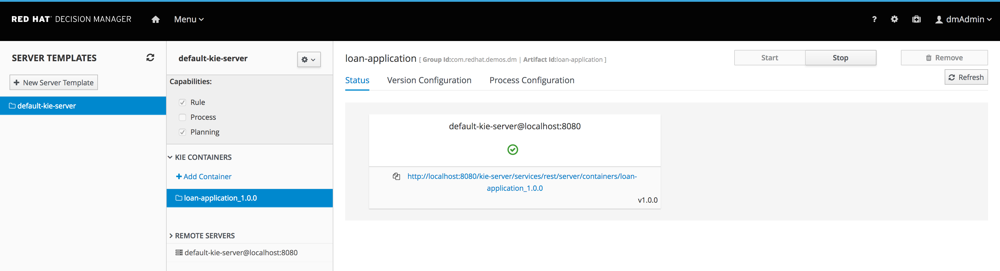
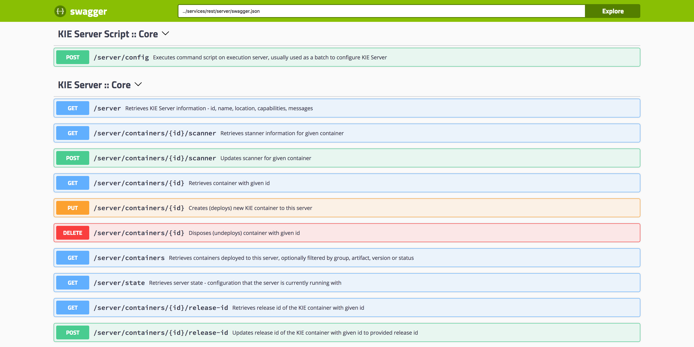
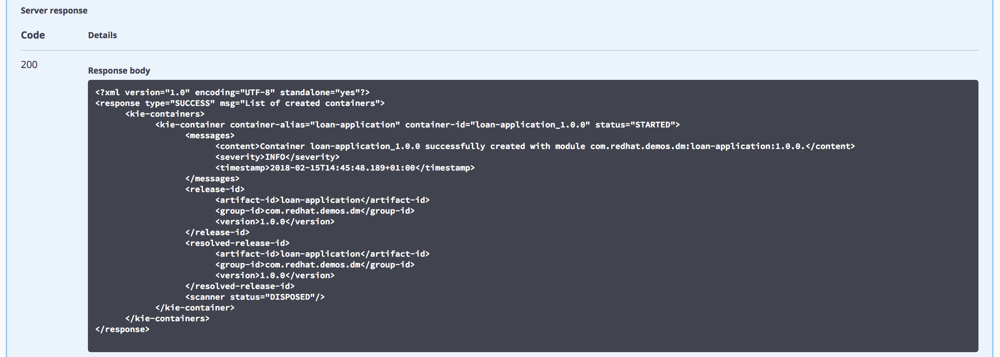
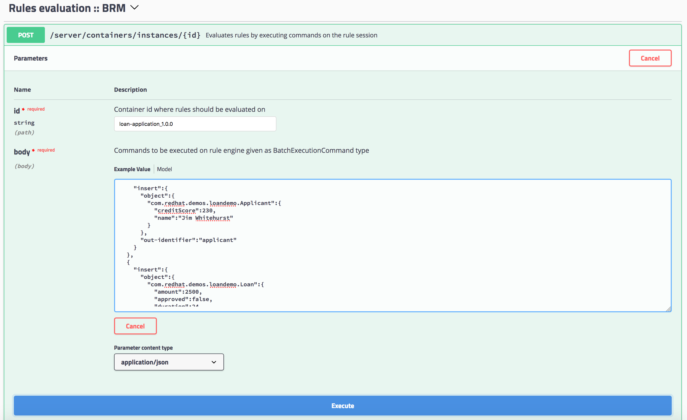
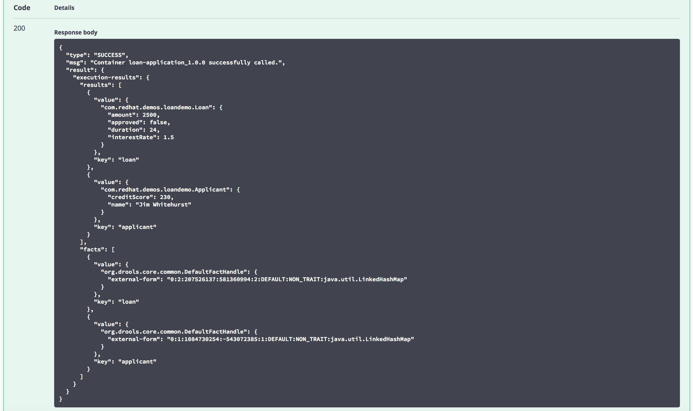

# WORKSHOP RHDM7
Workshop sobre o Red Hat Decision Manager 7 (ex-BRMS)

## Laboratório 05 - Execução das Regras
Este laboratório explora a execução das regras.

Obtenha a URL do Kie Server de sua instalação (depende do método de instalação feito: Standalone e Openshift).

Após, execute os passos 10 a 12 da opção 1 do projeto [rhdm7-loan-demo](https://github.com/jbossdemocentral/rhdm7-loan-demo).

